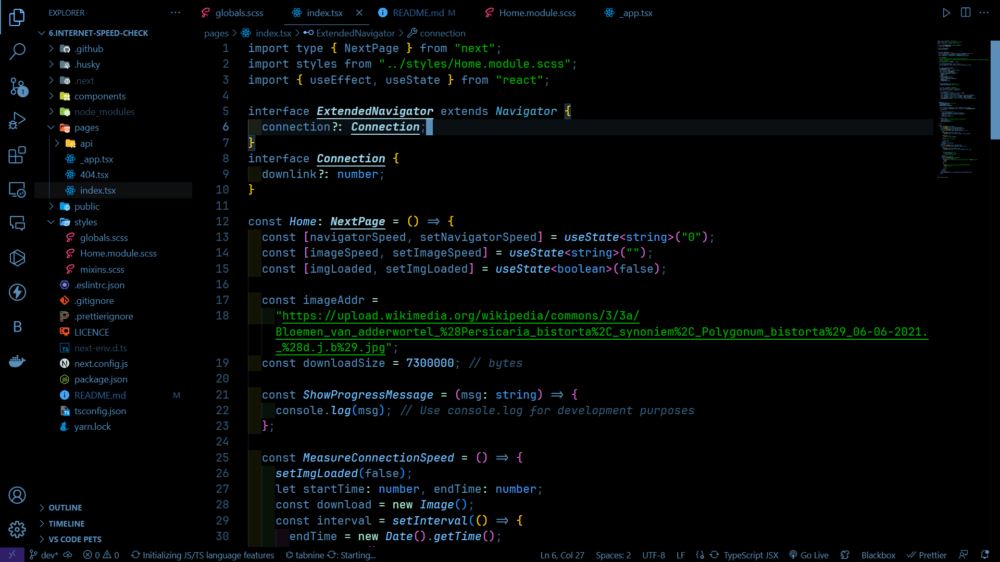
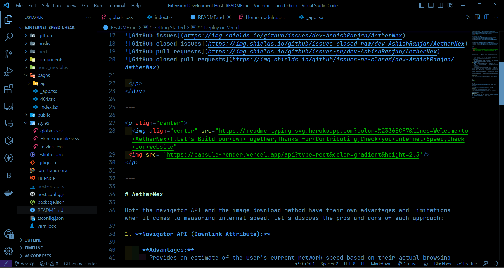
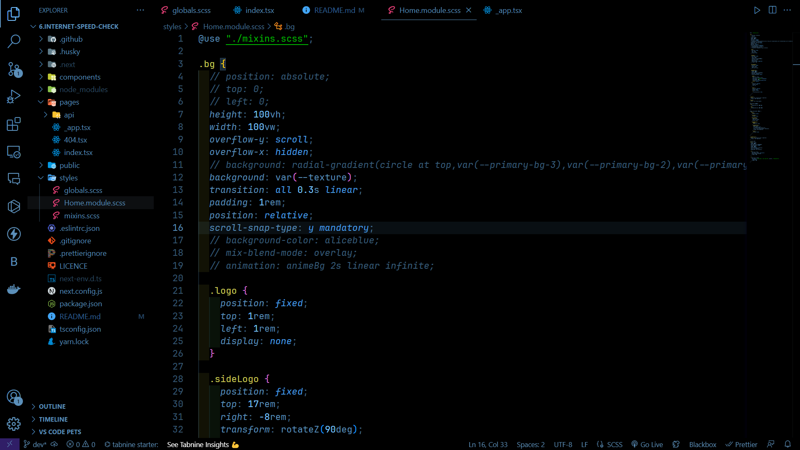
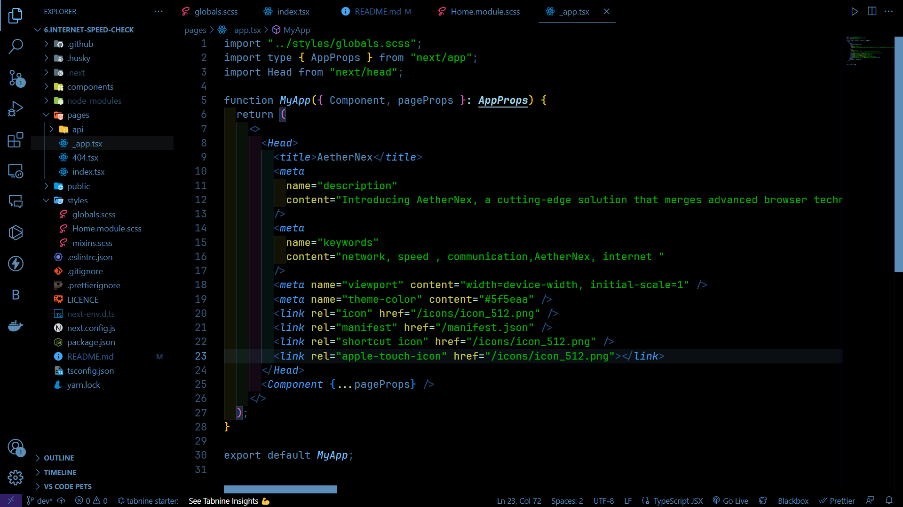
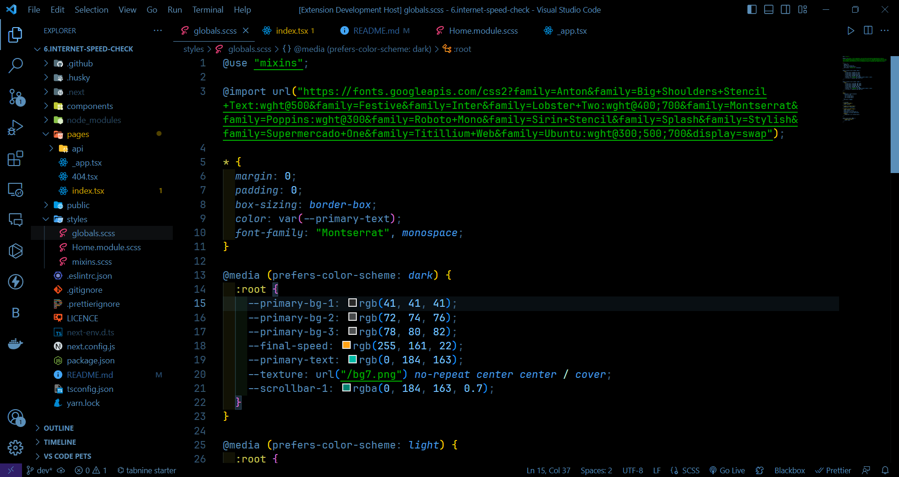

<div align="center">
 <p>
   
[](https://github.com/ellerbrock/open-source-badges/)


  


 </p>
</div>

---

# Installation via VS Code

1. Open **Extensions** sidebar panel in VS Code. `View -> Extensions`
2. Search for `Blackie`
3. Click on **Blackie**
4. Click **Install** to install it
5. Click **Reload** to reload the editor
6. Code > Preferences > Color Theme > **Blackie**

---

# Theme Preview

Here are some pics showcasing the **_Blackie_** Theme

| DARK                 |
| -------------------- |
|  |
|  |
|  |
|  |
|  |

---

# Development

Steps to create a new theme in VS Code

## 1. install yo

```
npm install -g yo
```

## 2. Install generator (we are using code)

```
npm install generator-code -g
```

## 3. Initilize a code using yo

```
npx yo code
```

This command will guide you through setting up your extension, including selecting the theme type.

## 4. Develop Your Theme

Open the project folder in your preferred code editor.
Navigate to the `themes` folder in your project directory. This is where you'll define your theme's color scheme and styling.
Edit the `.json` file in the `themes` folder to define the color scheme and other theme-related settings. You can also use a tool like "Theme Color Picker" in VS Code to help you design the color palette.

## 5. Test your Theme

use `F5` to start a dev vscode.
There Select your theme.
To change your theme in the new vscode window use `CTRL + K` + `CTRL + T`. Now a list of themes appear, select your development theme, it's shown there.

## 6. Publish

```
vsce login <publisher_id>
```

```
vsce publish
```

If You're facing the **proxy** problem 
then use this command: `vsce package`
and then upload it manually from vsix file on marketplace

All code in CLI or Terminal

---

## For more information

- [Visual Studio Code's Markdown Support](http://code.visualstudio.com/docs/languages/markdown)
- [Markdown Syntax Reference](https://help.github.com/articles/markdown-basics/)

**Enjoy!**
